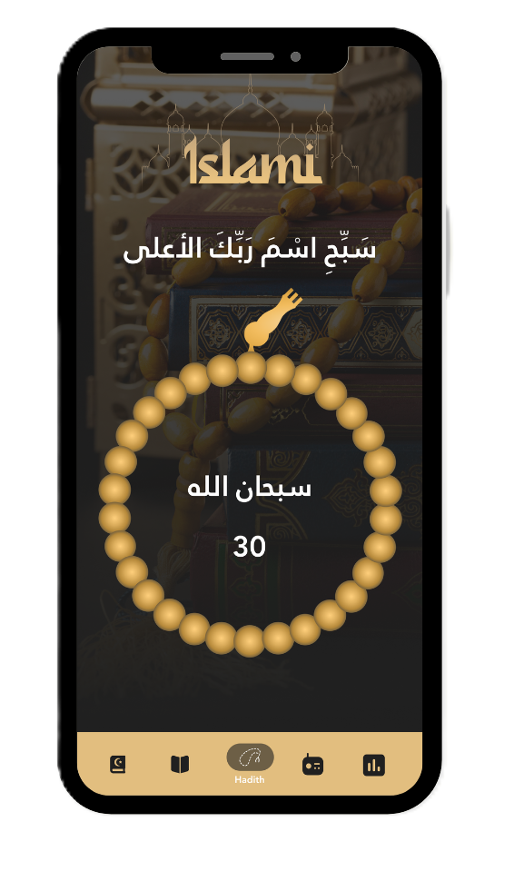
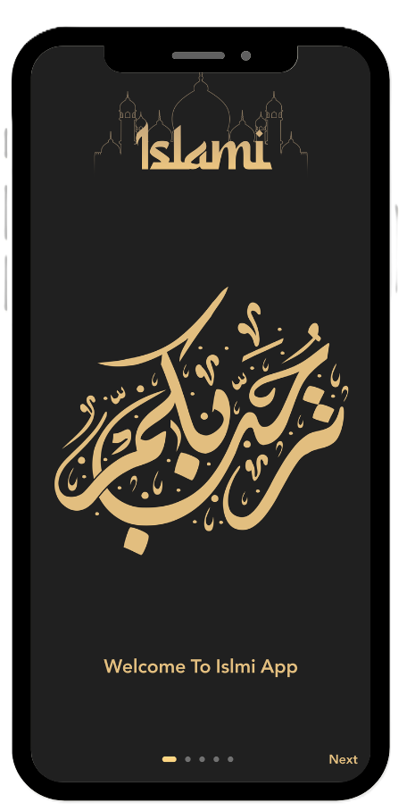
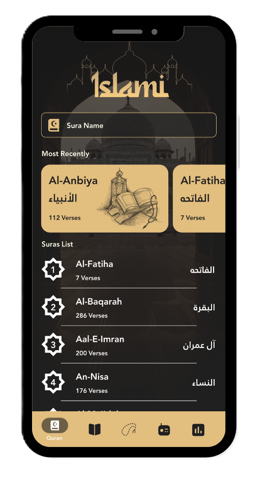
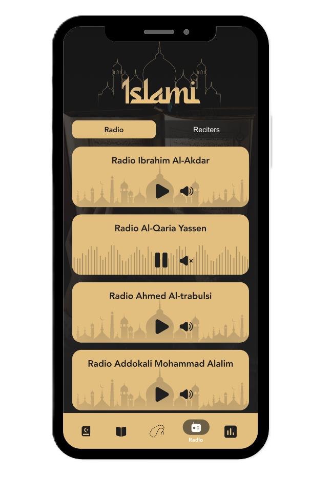
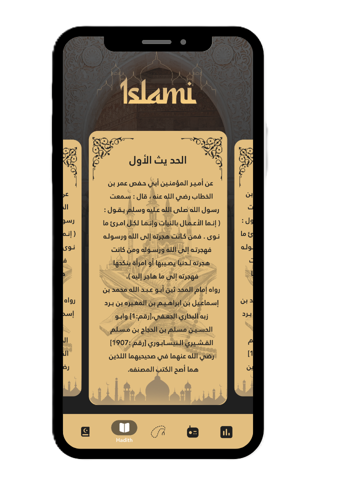
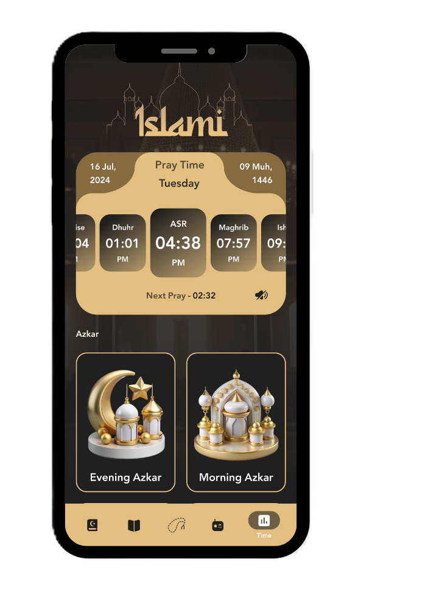

# Islami App

Islami App is a modern Flutter application designed to provide essential Islamic features through a clean, responsive, and user-friendly experience.

**This project represents my first complete mobile application built fully by myself**, where I explored real-world Flutter development concepts including API Integration, State Management, Responsive UI Design, and Local File Handling.

  
  

---

## ✨ Features

### 📖 Quran Section

* Read Quran Surahs with a clean and simple UI.
* Local Quran content handling using RootBundle & Assets.

### 📜 Hadith Section

* Browse and read Islamic Hadiths in an organized layout.

### 📿 Sebha Section

* Interactive Tasbih counter with smooth user interaction.

### 📻 Radio & Reciters

* Listen to Quran radio stations and different reciters.
* Dynamic content fetched using APIs.

### 🕌 Prayer Times

* Display accurate prayer times based on API data.
* Clean and responsive prayer timings UI.

### 🤲 Azkar Section

* Morning and Evening Azkar with a readable experience.

### 📱 Responsive Design

* Fully responsive UI for multiple screen sizes using ScreenUtil.

### ⚡ State Management

* Smooth and scalable state handling using Cubit (Bloc).

---

## 🛠 Tech Stack

| Layer            | Technology          |
| ---------------- | ------------------- |
| Framework        | Flutter             |
| Language         | Dart                |
| State Management | Cubit (Bloc)        |
| Networking       | REST APIs / Dio     |
| Responsive UI    | ScreenUtil          |
| Local Storage    | SharedPreferences & RootBundle & Assets |

---

## 📸 Screenshots

  
  
  
  
  
  
  

---

## ⭐ Support

If you like this project, consider giving it a star on GitHub ⭐

